# AI Messaging Tool - Complete Workflow Guide

## Overview

This document explains the complete workflow of the AI Messaging Tool, from CSV file upload to automated message generation and form submission. The system is designed to scrape websites, extract contact forms, generate personalized messages using AI, and automatically submit them.

## Complete Workflow Sequence Diagram

```mermaid
sequenceDiagram
    participant User
    participant Frontend
    participant FastAPI
    participant FileStorage
    participant Database
    participant Celery
    participant Scraper
    participant Selenium
    participant AI
    participant ContactForm

    Note over User,ContactForm: 1. File Upload Phase
    User->>Frontend: Upload CSV/Excel file
    Frontend->>FastAPI: POST /upload (file, user_id)
    FastAPI->>FileStorage: Save file
    FastAPI->>Database: Create file_upload record
    Database-->>FastAPI: file_upload_id
    FastAPI-->>Frontend: Upload success response
    Frontend-->>User: Show upload confirmation

    Note over User,ContactForm: 2. Website Extraction Phase
    FastAPI->>Celery: Trigger extract_websites_from_file_task
    Celery->>FileStorage: Read uploaded file
    Celery->>Celery: Parse CSV/Excel for URLs
    Celery->>Database: Create website records
    Celery->>Database: Update file_upload (totalWebsites)
    Celery->>Celery: Trigger scrape_websites_task

    Note over User,ContactForm: 3. Website Scraping Phase
    Celery->>Database: Create scraping_job record
    Celery->>Database: Update scraping_job status = RUNNING
    
    loop For each website URL
        Celery->>Scraper: Scrape website (URL)
        Scraper->>Scraper: HTTP request with retry
        alt HTTP Success
            Scraper->>Scraper: Static HTML analysis
            Scraper->>Scraper: Extract contact forms
            alt Contact form found
                Scraper->>Database: Save contact form URL
            else No contact form
                Scraper->>Selenium: Dynamic form detection
                Selenium->>Selenium: Browser automation
                alt Selenium Success
                    Selenium->>Database: Save popup form URL
                else Selenium Error
                    Selenium->>Database: Mark as failed
                end
            end
        else HTTP Error
            Scraper->>Scraper: Try alternative URLs
            Scraper->>Scraper: Try different user agents
            alt Retry Success
                Scraper->>Database: Save with fallback data
            else All strategies failed
                Scraper->>Database: Mark as FAILED
            end
        end
        
        Scraper->>Database: Update website record
        Scraper->>Database: Update scraping_job progress
        Scraper-->>Celery: Website processed
    end
    
    Celery->>Database: Update scraping_job status = COMPLETED
    Celery->>Celery: Trigger generate_messages_task

    Note over User,ContactForm: 4. Message Generation Phase
    Celery->>Database: Get scraped websites
    Database-->>Celery: Website data with contact forms
    
    loop For each scraped website
        Celery->>AI: Generate personalized message
        AI->>AI: Analyze company info
        AI->>AI: Create contextual message
        AI-->>Celery: Generated message + confidence
        Celery->>Database: Save generated message
        Celery->>Database: Update messageStatus = GENERATED
    end
    
    Celery->>Celery: Trigger submit_messages_task

    Note over User,ContactForm: 5. Form Submission Phase
    loop For each website with message
        Celery->>ContactForm: Detect form type
        ContactForm->>ContactForm: Analyze form structure
        alt Static HTML Form
            ContactForm->>ContactForm: Fill form fields
            ContactForm->>ContactForm: Submit via HTTP POST
        else Dynamic JavaScript Form
            ContactForm->>Selenium: Fill form with Selenium
            Selenium->>ContactForm: Submit via browser
        else API Endpoint
            ContactForm->>ContactForm: Submit via REST API
        end
        
        alt Submission Success
            ContactForm->>Database: Update status = SUBMITTED
        else Submission Failed
            ContactForm->>Database: Update status = FAILED
            ContactForm->>Database: Log error message
        end
    end

    Note over User,ContactForm: 6. Status Updates
    Database->>FastAPI: Update file_upload status
    FastAPI->>Frontend: Real-time progress updates
    Frontend->>User: Show completion status

    Note over User,ContactForm: Error Handling & Recovery
    rect rgb(255, 240, 240)
        Note over Celery,Database: Database Connection Errors
        Celery->>Celery: Retry with exponential backoff
        Celery->>Database: Reconnect and retry
        
        Note over Scraper,Selenium: Scraping Failures
        Scraper->>Scraper: Try alternative strategies
        Scraper->>Selenium: Fallback to Selenium
        Selenium->>Scraper: Handle browser errors
        
        Note over AI,Database: AI Generation Errors
        AI->>AI: Use fallback message templates
        AI->>Database: Log generation errors
    end

    Note over User,ContactForm: Parallel Processing
    par Multiple Websites
        Celery->>Scraper: Website 1
        and
        Celery->>Scraper: Website 2
        and
        Celery->>Scraper: Website N
    end
```



## System Architecture

### Backend Components
- **FastAPI**: REST API server
- **Celery**: Distributed task queue for background processing
- **PostgreSQL**: Primary database for storing file uploads, websites, and messages
- **Redis**: Message broker for Celery tasks
- **Selenium**: Web scraping for dynamic content
- **Requests**: HTTP client for basic scraping

### Frontend Components
- **Next.js**: React-based frontend
- **Material-UI**: UI components
- **TypeScript**: Type-safe JavaScript

## Complete Workflow

### 1. File Upload Phase 📁

#### 1.1 CSV/Excel Upload
```
User Uploads CSV → Frontend → FastAPI → File Storage → Database Record
```

**Process:**
1. User uploads CSV/Excel file via frontend
2. Frontend sends file to FastAPI endpoint (`/upload`)
3. File is saved to server storage (`/uploads/{user_id}/{timestamp}_{filename}`)
4. File upload record is created in `file_uploads` table
5. Initial status: `PENDING`

**Database Record:**
```sql
INSERT INTO file_uploads (
    id, userId, filename, originalName, fileSize, fileType, 
    status, totalWebsites, processedWebsites, failedWebsites
) VALUES (
    'unique_id', 'user_id', 'filename.csv', 'original_name.csv', 
    1024, 'csv', 'PENDING', 0, 0, 0
);
```

#### 1.2 Website Extraction
```
File Upload → Celery Task → Website Parsing → Database Storage
```

**Process:**
1. `extract_websites_from_file_task` is automatically triggered
2. CSV/Excel file is parsed to extract website URLs
3. URLs are validated and cleaned
4. Website records are created in `websites` table
5. File upload record is updated with total website count

**Celery Task:**
```python
@celery_app.task
def extract_websites_from_file_task(file_path, file_type, file_upload_id, user_id):
    # Parse file and extract websites
    websites = extract_websites_from_file(file_path, file_type)
    
    # Save to database
    for website in websites:
        create_website_data(user_id, file_upload_id, website['url'])
    
    # Update file upload
    update_file_upload(file_upload_id, {'totalWebsites': len(websites)})
    
    # Automatically trigger scraping
    scrape_websites_task.delay(file_upload_id, user_id, website_urls)
```

### 2. Website Scraping Phase 🕷️

#### 2.1 Scraping Job Creation
```
Website Extraction → Scraping Job → Celery Task → Database
```

**Process:**
1. Scraping job is created in `scraping_jobs` table
2. `scrape_websites_task` is triggered automatically
3. Job status: `PENDING` → `RUNNING` → `COMPLETED`

**Database Record:**
```sql
INSERT INTO scraping_jobs (
    id, fileUploadId, totalWebsites, status, 
    processedWebsites, failedWebsites
) VALUES (
    'job_id', 'file_upload_id', 10, 'PENDING', 0, 0
);
```

#### 2.2 Website Scraping Process
```
Website URL → Multiple Scraping Strategies → Contact Form Detection → Database Storage
```

**Scraping Strategies:**
1. **Basic HTTP Requests**: Initial page fetch
2. **Static Analysis**: Parse HTML for contact forms
3. **Selenium Detection**: Dynamic content and popup forms
4. **Fallback Methods**: Alternative URLs and user agents

**Scraping Process:**
```python
def scrape_website_data(url):
    # Strategy 1: Basic HTTP request
    response = requests.get(url)
    
    # Strategy 2: Static HTML analysis
    contact_forms = extract_contact_forms(response.text)
    
    # Strategy 3: Selenium for dynamic content
    if not contact_forms:
        contact_forms = detect_popup_forms_with_selenium(url)
    
    # Save to database
    return {
        'url': url,
        'contact_form_url': best_contact_form,
        'company_name': extracted_name,
        'industry': detected_industry,
        'scraping_status': 'COMPLETED'
    }
```

#### 2.3 Database Storage
```
Scraped Data → Enhanced Website Records → Status Updates
```

**Website Record:**
```sql
INSERT INTO websites (
    id, userId, fileUploadId, websiteUrl, 
    contactFormUrl, companyName, industry,
    scrapingStatus, messageStatus
) VALUES (
    'website_id', 'user_id', 'file_upload_id', 'https://example.com',
    'https://example.com/contact', 'Example Corp', 'Technology',
    'COMPLETED', 'PENDING'
);
```

### 3. Message Generation Phase 🤖

#### 3.1 AI Message Generation
```
Scraped Website Data → AI Analysis → Personalized Message → Database Storage
```

**Process:**
1. `generate_messages_task` is triggered after scraping
2. Website data is analyzed by AI (Gemini)
3. Personalized messages are generated
4. Messages are saved to database

**AI Generation:**
```python
def generate_ai_message(website_data, message_type):
    # Analyze website content
    company_info = extract_company_info(website_data)
    
    # Generate personalized message
    message = ai_generator.hybrid_message_generation(
        website_data, 
        message_type="general"
    )
    
    return {
        'message': message,
        'confidence_score': confidence,
        'method': 'hybrid'
    }
```

#### 3.2 Message Storage
```
AI Message → Database Record → Status Update
```

**Message Record:**
```sql
UPDATE websites SET 
    generatedMessage = 'personalized_message',
    messageStatus = 'GENERATED',
    confidenceScore = 0.85
WHERE id = 'website_id';
```

### 4. Form Submission Phase 📤

#### 4.1 Contact Form Detection
```
Website Data → Contact Form Analysis → Submission Strategy
```

**Contact Form Types:**
1. **Static Forms**: Standard HTML forms
2. **Dynamic Forms**: JavaScript-generated forms
3. **Popup Forms**: Modal/overlay forms
4. **API Endpoints**: REST API submissions

#### 4.2 Message Submission
```
Generated Message → Form Filling → HTTP Submission → Status Tracking
```

**Submission Process:**
```python
def submit_contact_form(website_data, message):
    # Detect form type
    form_type = detect_form_type(website_data['contact_form_url'])
    
    # Fill form fields
    form_data = {
        'name': 'AI Assistant',
        'email': 'ai@example.com',
        'message': message,
        'company': 'AI Messaging Tool'
    }
    
    # Submit form
    response = submit_form(website_data['contact_form_url'], form_data)
    
    # Update status
    update_website_message_status(website_id, 'SUBMITTED')
```

## Database Schema

### Core Tables

#### `file_uploads`
```sql
CREATE TABLE file_uploads (
    id VARCHAR PRIMARY KEY,
    userId VARCHAR NOT NULL,
    filename VARCHAR,
    originalName VARCHAR,
    fileSize INTEGER,
    fileType VARCHAR,
    status VARCHAR DEFAULT 'PENDING',
    totalWebsites INTEGER DEFAULT 0,
    processedWebsites INTEGER DEFAULT 0,
    failedWebsites INTEGER DEFAULT 0,
    createdAt TIMESTAMP DEFAULT CURRENT_TIMESTAMP,
    updatedAt TIMESTAMP DEFAULT CURRENT_TIMESTAMP
);
```

#### `websites`
```sql
CREATE TABLE websites (
    id VARCHAR PRIMARY KEY,
    userId VARCHAR NOT NULL,
    fileUploadId VARCHAR NOT NULL,
    websiteUrl VARCHAR NOT NULL,
    contactFormUrl VARCHAR,
    companyName VARCHAR,
    industry VARCHAR,
    businessType VARCHAR,
    scrapingStatus VARCHAR DEFAULT 'PENDING',
    messageStatus VARCHAR DEFAULT 'PENDING',
    generatedMessage TEXT,
    confidenceScore DECIMAL,
    createdAt TIMESTAMP DEFAULT CURRENT_TIMESTAMP,
    updatedAt TIMESTAMP DEFAULT CURRENT_TIMESTAMP
);
```

#### `scraping_jobs`
```sql
CREATE TABLE scraping_jobs (
    id VARCHAR PRIMARY KEY,
    fileUploadId VARCHAR NOT NULL,
    status VARCHAR DEFAULT 'PENDING',
    totalWebsites INTEGER DEFAULT 0,
    processedWebsites INTEGER DEFAULT 0,
    failedWebsites INTEGER DEFAULT 0,
    startedAt TIMESTAMP,
    completedAt TIMESTAMP,
    errorMessage TEXT,
    createdAt TIMESTAMP DEFAULT CURRENT_TIMESTAMP,
    updatedAt TIMESTAMP DEFAULT CURRENT_TIMESTAMP
);
```

## Status Flow

### File Upload Status
```
PENDING → IN_PROGRESS → COMPLETED
```

### Website Scraping Status
```
PENDING → RUNNING → COMPLETED/FAILED
```

### Message Status
```
PENDING → GENERATED → SUBMITTED
```

## Error Handling

### Common Issues

#### 1. Duplicate Records
**Problem**: Website extraction runs multiple times
**Solution**: Database constraints and cleanup procedures
```sql
-- Prevent duplicates
CREATE UNIQUE INDEX idx_website_url_file 
ON websites(fileUploadId, websiteUrl);
```

#### 2. Selenium Errors
**Problem**: User data directory conflicts
**Solution**: Unique user data directories
```python
options.add_argument(f'--user-data-dir=/tmp/chrome-{uuid.uuid4()}')
```

#### 3. Database Connection Issues
**Problem**: Connection timeouts and authentication
**Solution**: Robust connection handling with retries
```python
def get_connection():
    try:
        return psycopg2.connect(database_url)
    except Exception as e:
        logger.error(f"Database connection failed: {e}")
        raise
```

## Monitoring and Logging

### Celery Task Monitoring
```bash
# Monitor Celery workers
celery -A celery_app worker --loglevel=info

# Check task status
celery -A celery_app inspect active
```

### Database Monitoring
```sql
-- Check processing status
SELECT 
    fu.id,
    fu.filename,
    fu.totalWebsites,
    fu.processedWebsites,
    fu.status,
    COUNT(w.id) as actual_websites,
    COUNT(CASE WHEN w.scrapingStatus = 'COMPLETED' THEN 1 END) as scraped
FROM file_uploads fu
LEFT JOIN websites w ON fu.id = w.fileUploadId
GROUP BY fu.id;
```

### Log Analysis
```bash
# Monitor scraping progress
tail -f logs/celery.log | grep "Scraping website"

# Check for errors
grep -i "error\|exception\|failed" logs/celery.log
```

## Performance Optimization

### Batch Processing
- Process websites in batches of 10-20
- Use connection pooling for database
- Implement retry mechanisms with exponential backoff

### Caching
- Cache website content to avoid re-scraping
- Store AI-generated messages for similar companies
- Use Redis for session management

### Rate Limiting
- Implement delays between requests (1-3 seconds)
- Use rotating user agents
- Respect robots.txt files

## Security Considerations

### Data Protection
- Encrypt sensitive data in database
- Use HTTPS for all API communications
- Implement proper authentication and authorization

### Web Scraping Ethics
- Respect robots.txt files
- Implement reasonable rate limiting
- Handle errors gracefully
- Use proper user agent strings

## Troubleshooting Guide

### Common Issues

#### 1. "Processed: 100" but "Total: 10"
**Cause**: Database corruption or duplicate records
**Solution**: Clean up duplicates and sync data
```sql
-- Remove duplicates
DELETE FROM websites WHERE id NOT IN (
    SELECT MIN(id) FROM websites 
    GROUP BY fileUploadId, websiteUrl
);
```

#### 2. Scraping Stops Midway
**Cause**: Selenium errors or network issues
**Solution**: Check logs and restart workers
```bash
# Restart Celery workers
pkill -f celery
nohup celery -A celery_app worker --loglevel=info &
```

#### 3. Message Generation Fails
**Cause**: AI API issues or invalid data
**Solution**: Check AI service status and data quality
```python
# Validate website data before AI processing
if not website_data.get('company_name'):
    website_data['company_name'] = extract_company_name(website_data['url'])
```

## Future Enhancements

### Planned Features
1. **Advanced AI Models**: Integration with GPT-4 and Claude
2. **Multi-language Support**: Generate messages in different languages
3. **A/B Testing**: Test different message variations
4. **Analytics Dashboard**: Track success rates and performance
5. **API Integrations**: Connect with CRM systems

### Scalability Improvements
1. **Microservices Architecture**: Split into smaller services
2. **Kubernetes Deployment**: Container orchestration
3. **Message Queues**: RabbitMQ for better task distribution
4. **CDN Integration**: Faster content delivery
5. **Database Sharding**: Horizontal scaling

---

## Summary

The AI Messaging Tool workflow is a comprehensive system that:

1. **Uploads and processes** CSV/Excel files with website URLs
2. **Scrapes websites** using multiple strategies to find contact forms
3. **Generates personalized messages** using AI based on company information
4. **Automatically submits** messages through detected contact forms
5. **Tracks progress** and provides detailed status updates

The system is designed to be robust, scalable, and user-friendly, with comprehensive error handling and monitoring capabilities. 