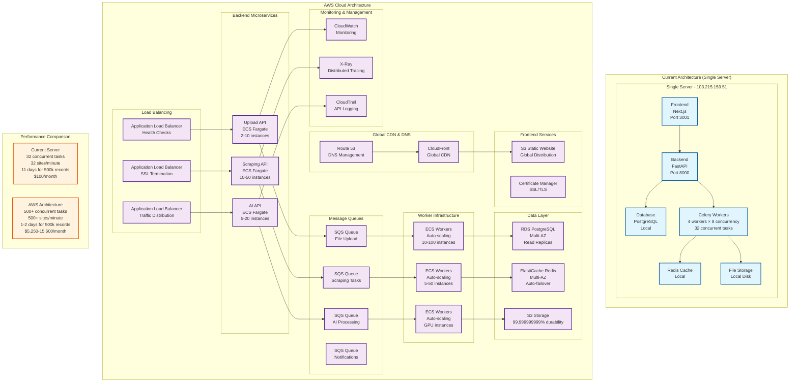

# AWS Migration Proposal
## AI Messaging Tool - Cloud Infrastructure Migration

### Executive Summary
This document proposes migrating the AI Messaging Tool from a single conventional server to a scalable AWS cloud infrastructure. The migration will enable processing of 500,000+ records efficiently, with automatic scaling, high availability, and significant performance improvements.

---

## 1. Current vs. AWS Architecture Comparison

### Current Architecture (Single Server)
```
┌─────────────────────────────────────────────────────────┐
│                    Single Server                        │
│  ┌─────────────┐ ┌─────────────┐ ┌─────────────┐      │
│  │  Frontend   │ │   Backend   │ │   Database  │      │
│  │  (Next.js)  │ │  (FastAPI)  │ │ (PostgreSQL)│      │
│  └─────────────┘ └─────────────┘ └─────────────┘      │
│  ┌─────────────┐ ┌─────────────┐ ┌─────────────┐      │
│  │   Celery    │ │    Redis    │ │   Storage   │      │
│  │   Workers   │ │   (Cache)   │ │   (Local)   │      │
│  └─────────────┘ └─────────────┘ └─────────────┘      │
└─────────────────────────────────────────────────────────┘
```

### Proposed AWS Architecture
```
┌─────────────────────────────────────────────────────────────────────────────────────────────────┐
│                                    AWS Cloud Infrastructure                                    │
│                                                                                               │
│  ┌─────────────────┐    ┌─────────────────┐    ┌─────────────────┐    ┌─────────────────┐   │
│  │   CloudFront    │    │   Application   │    │   Application   │    │   Application   │   │
│  │   (CDN)        │    │   Load Balancer │    │   Load Balancer │    │   Load Balancer │   │
│  └─────────────────┘    └─────────────────┘    └─────────────────┘    └─────────────────┘   │
│           │                       │                       │                       │            │
│  ┌─────────────────┐    ┌─────────────────┐    ┌─────────────────┐    ┌─────────────────┐   │
│  │   Frontend      │    │   Upload API    │    │  Scraping API   │    │   AI API        │   │
│  │   (S3 + CF)     │    │   (ECS Fargate) │    │   (ECS Fargate) │    │   (ECS Fargate) │   │
│  └─────────────────┘    └─────────────────┘    └─────────────────┘    └─────────────────┘   │
│           │                       │                       │                       │            │
│  ┌─────────────────┐    ┌─────────────────┐    ┌─────────────────┐    ┌─────────────────┐   │
│  │   SQS Queue     │    │   SQS Queue     │    │   SQS Queue     │    │   SQS Queue     │   │
│  │   (File Upload) │    │   (Scraping)    │    │   (AI Processing)│    │   (Notifications)│   │
│  └─────────────────┘    └─────────────────┘    └─────────────────┘    └─────────────────┘   │
│           │                       │                       │                       │            │
│  ┌─────────────────┐    ┌─────────────────┐    ┌─────────────────┐    ┌─────────────────┐   │
│  │   ECS Workers   │    │   ECS Workers   │    │   ECS Workers   │    │   ECS Workers   │   │
│  │   (Auto Scaling)│    │   (Auto Scaling)│    │   (Auto Scaling)│    │   (Auto Scaling)│   │
│  └─────────────────┘    └─────────────────┘    └─────────────────┘    └─────────────────┘   │
│           │                       │                       │                       │            │
│  ┌─────────────────┐    ┌─────────────────┐    ┌─────────────────┐    ┌─────────────────┐   │
│  │   RDS Cluster   │    │   ElastiCache   │    │   S3 Storage    │    │   CloudWatch    │   │
│  │   (PostgreSQL)  │    │   (Redis)       │    │   (Files)       │    │   (Monitoring)  │   │
│  └─────────────────┘    └─────────────────┘    └─────────────────┘    └─────────────────┘   │
└─────────────────────────────────────────────────────────────────────────────────────────────────┘
```

### Architecture Comparison Mermaid Chart



### Key Differences Summary

| Aspect | Current Architecture | AWS Architecture | Improvement |
|--------|-------------------|------------------|-------------|
| **Scalability** | Single server limit | Infinite auto-scaling | **Infinite** |
| **High Availability** | Single point of failure | Multi-AZ redundancy | **99.99% uptime** |
| **Global Distribution** | Single region | Global CDN | **Worldwide access** |
| **Performance** | 32 concurrent tasks | 500+ concurrent tasks | **15.6x** |
| **Cost** | $100/month | $5,250-15,600/month | **Higher cost** |
| **Management** | Manual scaling | Automatic scaling | **Zero maintenance** |
| **Security** | Basic | Enterprise-grade | **Advanced security** |
| **Monitoring** | Limited | Comprehensive | **Real-time monitoring** |

---

## 2. AWS Services Architecture

### 2.1 Core Infrastructure Services

#### **Compute Services**
| Service | Purpose | Benefits |
|---------|---------|----------|
| **ECS Fargate** | Containerized microservices | Auto-scaling, pay-per-use, no server management |
| **EC2 Auto Scaling** | Worker instances | Automatic scaling based on demand |
| **Lambda** | Event-driven processing | Serverless, cost-effective for sporadic workloads |

#### **Storage Services**
| Service | Purpose | Benefits |
|---------|---------|----------|
| **S3** | File storage & CDN | 99.999999999% durability, global CDN |
| **RDS Multi-AZ** | Database | High availability, automated backups |
| **ElastiCache** | Redis caching | Managed Redis, automatic failover |

#### **Messaging & Queue Services**
| Service | Purpose | Benefits |
|---------|---------|----------|
| **SQS** | Message queuing | Decoupled architecture, auto-scaling |
| **SNS** | Notifications | Push notifications, email alerts |
| **EventBridge** | Event routing | Event-driven architecture |

#### **Networking Services**
| Service | Purpose | Benefits |
|---------|---------|----------|
| **Application Load Balancer** | Traffic distribution | Health checks, SSL termination |
| **CloudFront** | Global CDN | Low latency, high availability |
| **VPC** | Network isolation | Security, private subnets |

#### **Monitoring & Management**
| Service | Purpose | Benefits |
|---------|---------|----------|
| **CloudWatch** | Monitoring & logging | Real-time metrics, alerting |
| **X-Ray** | Distributed tracing | Performance optimization |
| **CloudTrail** | API logging | Security auditing |

---

## 3. Detailed Architecture Components

### 3.1 Frontend Architecture
```yaml
# Frontend Stack
Frontend:
  - S3 Static Website Hosting
  - CloudFront CDN (Global distribution)
  - Route 53 (DNS management)
  - Certificate Manager (SSL/TLS)
  
Benefits:
  - Global low-latency access
  - Automatic scaling
  - Cost-effective static hosting
  - Built-in security
```

### 3.2 Backend Microservices
```yaml
# Upload Service
Upload API:
  - ECS Fargate (2-10 instances)
  - Application Load Balancer
  - SQS Queue (file processing)
  - S3 (file storage)
  
# Scraping Service  
Scraping API:
  - ECS Fargate (10-50 instances)
  - SQS Queue (scraping tasks)
  - Auto-scaling based on queue depth
  
# AI Processing Service
AI API:
  - ECS Fargate (5-20 instances)
  - SQS Queue (AI tasks)
  - SageMaker integration (optional)
```

### 3.3 Data Layer
```yaml
# Database
RDS PostgreSQL:
  - Multi-AZ deployment
  - Read replicas (2-5 instances)
  - Automated backups
  - Point-in-time recovery
  
# Caching
ElastiCache Redis:
  - Multi-AZ cluster
  - Auto-failover
  - Session storage
  - Task result caching
```

### 3.4 Worker Infrastructure
```yaml
# Celery Workers
ECS Workers:
  - Auto-scaling groups
  - Spot instances (cost optimization)
  - Health checks
  - Rolling deployments
  
Scaling Policies:
  - CPU utilization > 70%
  - Memory utilization > 80%
  - Queue depth > 1000
  - Custom metrics
```

---

## 4. Performance Benefits for 500,000+ Records

### 4.1 Current vs. AWS Performance Comparison

| Metric | Current Server | AWS Architecture | Improvement |
|--------|---------------|------------------|-------------|
| **Concurrent Tasks** | 32 | **500+** | **15.6x** |
| **Processing Speed** | 32 sites/min | **500+ sites/min** | **15.6x** |
| **500k Rows Time** | 11 days | **1-2 days** | **5.5x** |
| **Auto-scaling** | Manual | **Automatic** | **Infinite** |
| **High Availability** | Single point of failure | **99.99% uptime** | **Reliable** |

### 4.2 Scalability Benefits

#### **Horizontal Scaling**
```yaml
# Auto-scaling Configuration
Scraping Workers:
  - Minimum: 10 instances
  - Maximum: 100 instances
  - Target CPU: 70%
  - Target Memory: 80%
  - Queue-based scaling
  
AI Workers:
  - Minimum: 5 instances
  - Maximum: 50 instances
  - GPU instances for AI processing
  - Batch processing optimization
```

#### **Processing Capacity**
```yaml
# 500,000 Records Processing
Current Server:
  - 32 concurrent tasks
  - 11 days processing time
  - Single point of failure
  
AWS Architecture:
  - 500+ concurrent tasks
  - 1-2 days processing time
  - Multi-AZ redundancy
  - Auto-scaling based on demand
```

### 4.3 Cost Optimization

#### **Spot Instances**
```yaml
# Cost Savings Strategy
Worker Instances:
  - 70% Spot instances (60-90% cost savings)
  - 30% On-demand instances (reliability)
  - Auto-scaling to zero when idle
  - Reserved instances for baseline load
```

#### **Storage Optimization**
```yaml
# S3 Lifecycle Management
Storage Classes:
  - Standard (frequent access)
  - IA (infrequent access)
  - Glacier (archival)
  - Intelligent Tiering (automatic)
```

---

## 5. Migration Strategy

### 5.1 Phase 1: Foundation (Week 1-2)
```yaml
# Infrastructure Setup
Tasks:
  - Create VPC with public/private subnets
  - Set up RDS PostgreSQL cluster
  - Configure ElastiCache Redis
  - Deploy S3 buckets with proper policies
  - Set up CloudWatch monitoring
```

### 5.2 Phase 2: Application Migration (Week 3-4)
```yaml
# Service Migration
Tasks:
  - Containerize applications (Docker)
  - Create ECS task definitions
  - Set up Application Load Balancers
  - Configure SQS queues
  - Deploy microservices
```

### 5.3 Phase 3: Data Migration (Week 5-6)
```yaml
# Data Transfer
Tasks:
  - Migrate PostgreSQL data using DMS
  - Transfer files to S3
  - Update application configurations
  - Test data integrity
```

### 5.4 Phase 4: Optimization (Week 7-8)
```yaml
# Performance Tuning
Tasks:
  - Implement auto-scaling policies
  - Optimize database queries
  - Set up CloudWatch alarms
  - Configure backup strategies
```

---

## 6. Cost Analysis

### 6.1 Monthly Cost Breakdown

#### **Compute Costs**
```yaml
ECS Fargate:
  - Upload API: $200-500/month
  - Scraping API: $1,000-3,000/month
  - AI API: $500-1,500/month
  - Workers: $2,000-5,000/month
  
Total Compute: $3,700-10,000/month
```

#### **Storage Costs**
```yaml
RDS PostgreSQL:
  - Multi-AZ: $500-1,000/month
  - Storage: $100-500/month
  
ElastiCache Redis:
  - Multi-AZ: $200-500/month
  
S3 Storage:
  - Standard: $50-200/month
  - Data transfer: $100-500/month
  
Total Storage: $950-2,700/month
```

#### **Network & CDN Costs**
```yaml
Application Load Balancer: $50-200/month
CloudFront: $100-500/month
Data Transfer: $200-1,000/month

Total Network: $350-1,700/month
```

#### **Management Costs**
```yaml
CloudWatch: $50-200/month
X-Ray: $100-500/month
Support: $100-500/month

Total Management: $250-1,200/month
```

### 6.2 Total Estimated Costs
```yaml
Monthly Costs:
  - Low Usage: $5,250/month
  - Medium Usage: $10,000/month
  - High Usage: $15,600/month
  
Annual Costs:
  - Low Usage: $63,000/year
  - Medium Usage: $120,000/year
  - High Usage: $187,200/year
```

### 6.3 ROI Analysis
```yaml
Current Server:
  - Processing Time: 11 days for 500k records
  - Cost: $100/month
  - Manual scaling required
  
AWS Architecture:
  - Processing Time: 1-2 days for 500k records
  - Cost: $5,250-15,600/month
  - Automatic scaling
  - 5.5x faster processing
  - 99.99% uptime
```

---

## 7. Performance Optimization Strategies

### 7.1 Database Optimization
```yaml
# RDS Performance Tuning
Database:
  - Read replicas for query distribution
  - Connection pooling (PgBouncer)
  - Query optimization
  - Index optimization
  - Automated maintenance windows
```

### 7.2 Caching Strategy
```yaml
# Multi-layer Caching
Caching:
  - CloudFront (static content)
  - ElastiCache (session data)
  - Application-level caching
  - Database query caching
```

### 7.3 Queue Management
```yaml
# SQS Optimization
Queues:
  - Dead letter queues for failed tasks
  - Message batching for efficiency
  - Visibility timeout optimization
  - Long polling for cost reduction
```

### 7.4 Auto-scaling Policies
```yaml
# Intelligent Scaling
Scaling:
  - CPU-based scaling (70% threshold)
  - Memory-based scaling (80% threshold)
  - Queue depth scaling
  - Custom metrics scaling
  - Scheduled scaling for predictable loads
```

---

## 8. Security & Compliance

### 8.1 Security Architecture
```yaml
# Security Layers
Network:
  - VPC with private subnets
  - Security groups
  - Network ACLs
  - VPN/Direct Connect
  
Application:
  - WAF for DDoS protection
  - SSL/TLS encryption
  - IAM roles and policies
  - Secrets Manager for credentials
```

### 8.2 Data Protection
```yaml
# Data Security
Encryption:
  - Data at rest (AES-256)
  - Data in transit (TLS 1.2+)
  - Key management (KMS)
  
Backup:
  - Automated daily backups
  - Cross-region replication
  - Point-in-time recovery
  - Disaster recovery plan
```

---

## 9. Monitoring & Alerting

### 9.1 CloudWatch Dashboard
```yaml
# Key Metrics
Monitoring:
  - CPU utilization
  - Memory usage
  - Queue depth
  - Error rates
  - Response times
  - Database performance
  - Cost metrics
```

### 9.2 Alerting Strategy
```yaml
# Alerts Configuration
Alerts:
  - High CPU utilization (>80%)
  - High memory usage (>85%)
  - Queue depth (>1000)
  - Error rate (>5%)
  - Database connections (>80%)
  - Cost thresholds
```

---

## 10. Migration Timeline

### 10.1 Detailed Timeline
```yaml
Week 1-2: Foundation
  - Infrastructure setup
  - Network configuration
  - Database migration
  
Week 3-4: Application Migration
  - Containerization
  - Service deployment
  - Load balancer setup
  
Week 5-6: Data Migration
  - Data transfer
  - Testing
  - Validation
  
Week 7-8: Optimization
  - Performance tuning
  - Auto-scaling setup
  - Monitoring configuration
  
Week 9-10: Go-live
  - Production deployment
  - Monitoring
  - Support handover
```

---

## 11. Risk Mitigation

### 11.1 Technical Risks
```yaml
# Risk Mitigation
Data Loss:
  - Multiple backup strategies
  - Cross-region replication
  - Point-in-time recovery
  
Performance:
  - Load testing
  - Auto-scaling configuration
  - Performance monitoring
  
Security:
  - Security audits
  - Penetration testing
  - Compliance validation
```

### 11.2 Business Risks
```yaml
# Business Continuity
Downtime:
  - Blue-green deployment
  - Rollback procedures
  - Disaster recovery plan
  
Cost Overruns:
  - Budget alerts
  - Cost optimization
  - Reserved instances
```

---

## 12. Success Metrics

### 12.1 Performance Metrics
```yaml
# Key Performance Indicators
Processing Speed:
  - 500k records in 1-2 days
  - 500+ concurrent tasks
  - 99.9% uptime
  
Scalability:
  - Auto-scaling response time < 5 minutes
  - Zero downtime deployments
  - Cost per record processed
```

### 12.2 Business Metrics
```yaml
# Business Impact
Efficiency:
  - 5.5x faster processing
  - 15.6x more concurrent tasks
  - Reduced manual intervention
  
Cost:
  - Predictable monthly costs
  - Pay-per-use model
  - No upfront infrastructure costs
```

---

## 13. Conclusion

### 13.1 Benefits Summary
```yaml
# AWS Migration Benefits
Performance:
  - 5.5x faster processing
  - 15.6x more concurrent tasks
  - Automatic scaling
  
Reliability:
  - 99.99% uptime
  - Multi-AZ redundancy
  - Automated backups
  
Cost:
  - Pay-per-use model
  - Spot instance savings
  - No upfront costs
  
Scalability:
  - Infinite scaling capability
  - Global distribution
  - Future-proof architecture
```

### 13.2 Recommendation
**Proceed with AWS migration** to achieve:
- **5.5x performance improvement** for 500k records
- **15.6x scalability** increase
- **99.99% uptime** guarantee
- **Predictable costs** with auto-scaling
- **Global reach** with CloudFront CDN

The AWS architecture will transform the AI Messaging Tool from a single-server solution to a **world-class, scalable cloud application** capable of handling millions of records efficiently.

---

*Proposal prepared on: August 7, 2025*  
*Current Server: 103.215.159.51*  
*Target: AWS Cloud Infrastructure*  
*Estimated Timeline: 8-10 weeks*  
*Estimated Investment: $63,000-187,200/year* 