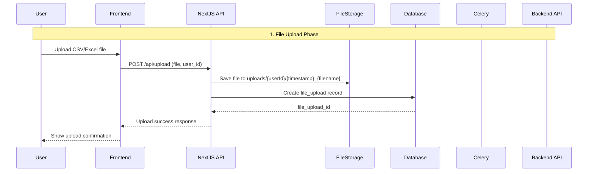
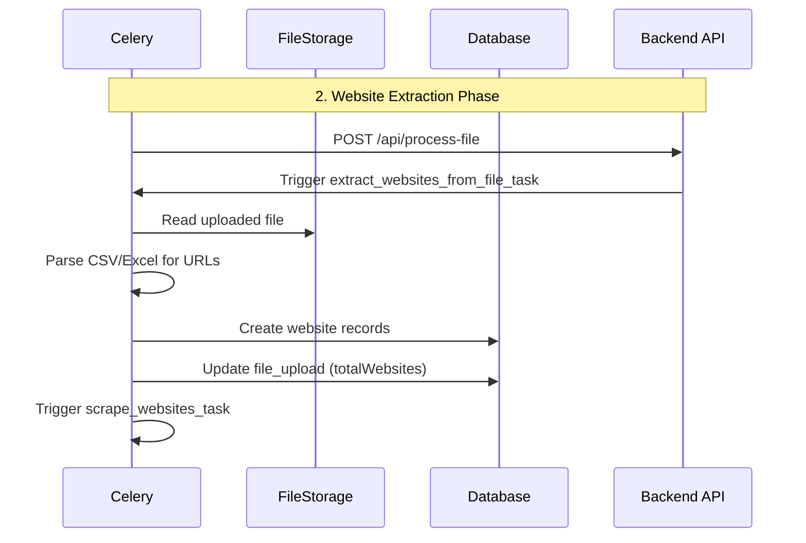
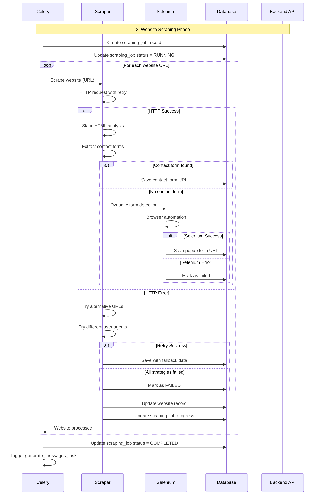
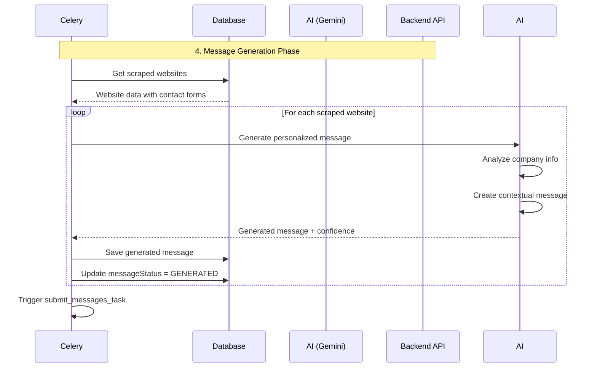
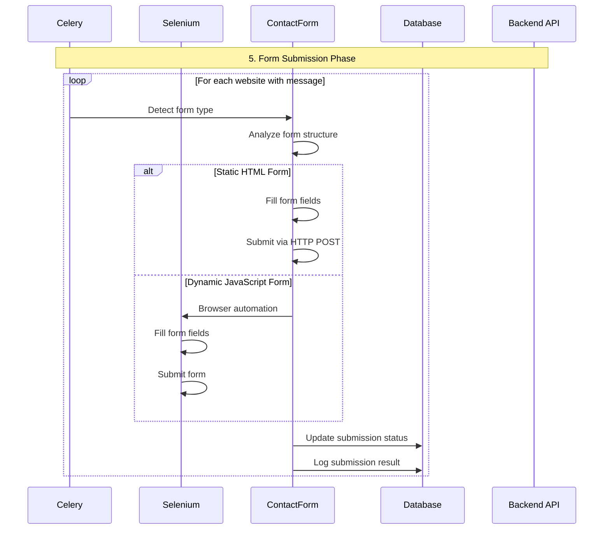

# CSV Upload and Processing Workflow - Complete Guide

## Overview

This document explains the complete workflow of the AI Messaging Tool, from CSV file upload to automated contact form submission. The system processes website URLs, scrapes contact forms, generates personalized AI messages, and automatically submits them.

## 🚀 Complete Workflow Sequence

### Phase 1: File Upload & Initial Processing



**Step-by-Step Process:**

1. **File Upload Validation**
   - User selects CSV/Excel file on frontend
   - Frontend validates file type (.csv, .xlsx, .xls)
   - File size limit: 100MB
   - Unique filename check per user

2. **File Storage**
   - File saved to: `uploads/{userId}/{timestamp}_{filename}`
   - Example: `uploads/user123/1703123456_websites.csv`

3. **Database Record Creation**
   ```sql
   INSERT INTO file_uploads (
       id, user_id, original_name, file_path, 
       total_websites, status, created_at
   ) VALUES (
       'cuid_xxx', 'user123', 'websites.csv', 
       'uploads/user123/1703123456_websites.csv', 
       0, 'PENDING', NOW()
   )
   ```

### Phase 2: Website Extraction & Parsing



**Step-by-Step Process:**

1. **File Parsing**
   - Celery task reads the uploaded file
   - Supports CSV and Excel formats
   - Flexible column detection:
     - Website URL columns: `Website URL`, `website_url`, `Website`, `URL`, `url`
     - Contact Form columns: `Contact Form URL`, `contact_form_url`, `Contact Form`, `Contact`

2. **URL Validation**
   ```python
   def validate_website_url(url: str) -> bool:
       # Must have http/https scheme
       # Must have valid domain
       # Must have proper format
   ```

3. **Database Records Creation**
   ```sql
   INSERT INTO websites (
       id, file_upload_id, website_url, contact_form_url,
       scraping_status, message_status, created_at
   ) VALUES (
       'cuid_xxx', 'file_upload_id', 'https://example.com',
       NULL, 'PENDING', 'PENDING', NOW()
   )
   ```

### Phase 3: Website Scraping & Contact Form Detection



**Step-by-Step Process:**

1. **Robust Web Scraping**
   - **HTTP Requests**: Primary method using requests library
   - **Retry Strategy**: 3 retries with exponential backoff
   - **User Agent Rotation**: Multiple user agents to avoid detection
   - **Timeout Handling**: 30-second timeout per request

2. **Contact Form Detection**
   - **Static Analysis**: BeautifulSoup parsing for HTML forms
   - **Form Detection Patterns**:
     ```python
     # Contact form indicators
     - Form with "contact" in action/class/id
     - Input fields: name, email, phone, message
     - Submit buttons with contact-related text
     ```

3. **Selenium Fallback**
   - **Dynamic Content**: JavaScript-rendered forms
   - **Popup Detection**: Modal contact forms
   - **Headless Browser**: Chrome with automation flags disabled

4. **Error Handling Strategies**
   - **Connection Errors**: Try HTTP/HTTPS variations
   - **DNS Errors**: Alternative domain formats
   - **Timeout Errors**: Reduced timeout retries
   - **Blocked Requests**: User agent rotation

### Phase 4: AI Message Generation



**Step-by-Step Process:**

1. **Company Information Extraction**
   ```python
   def extract_company_info(html: str, base_url: str) -> Dict:
       return {
           'company_name': extract_company_name(html),
           'industry': detect_industry(html),
           'services': extract_services(html),
           'contact_info': extract_contact_info(html)
       }
   ```

2. **AI Message Generation**
   - **Gemini Integration**: Google's Gemini AI model
   - **Context Analysis**: Company info, industry, services
   - **Personalization**: Industry-specific messaging
   - **Message Types**: General, Partnership, Inquiry, Custom

3. **Message Quality Control**
   - **Confidence Scoring**: AI confidence in message quality
   - **Content Validation**: Check for appropriate content
   - **Length Optimization**: Optimal message length for forms

### Phase 5: Contact Form Submission



**Step-by-Step Process:**

1. **Form Field Detection**
   ```python
   def detect_contact_form_fields(form_url: str) -> Dict:
       return {
           'name': detect_name_field(driver),
           'email': detect_email_field(driver),
           'phone': detect_phone_field(driver),
           'subject': detect_subject_field(driver),
           'message': detect_message_field(driver),
           'company': detect_company_field(driver)
       }
   ```

2. **Form Submission Methods**
   - **Static Forms**: Direct HTTP POST requests
   - **Dynamic Forms**: Selenium browser automation
   - **JavaScript Forms**: Wait for form loading and submission

3. **Submission Data**
   ```python
   user_config = {
       'sender_name': 'John Doe',
       'sender_email': 'john.doe@example.com',
       'sender_phone': '+1-555-123-4567',
       'message_subject': 'Business Inquiry',
       'company_name': 'Your Company'
   }
   ```

4. **Error Handling**
   - **CAPTCHA Detection**: Handle CAPTCHA challenges
   - **Rate Limiting**: Respect server rate limits
   - **Submission Failures**: Log and retry mechanisms

## 📊 Database Schema Overview

### Core Tables

1. **file_uploads**
   ```sql
   CREATE TABLE file_uploads (
       id VARCHAR PRIMARY KEY,
       user_id VARCHAR NOT NULL,
       original_name VARCHAR NOT NULL,
       file_path VARCHAR NOT NULL,
       total_websites INTEGER DEFAULT 0,
       processed_websites INTEGER DEFAULT 0,
       failed_websites INTEGER DEFAULT 0,
       status VARCHAR DEFAULT 'PENDING',
       created_at TIMESTAMP DEFAULT NOW()
   );
   ```

2. **websites**
   ```sql
   CREATE TABLE websites (
       id VARCHAR PRIMARY KEY,
       file_upload_id VARCHAR REFERENCES file_uploads(id),
       website_url VARCHAR NOT NULL,
       contact_form_url VARCHAR,
       company_name VARCHAR,
       industry VARCHAR,
       scraping_status VARCHAR DEFAULT 'PENDING',
       message_status VARCHAR DEFAULT 'PENDING',
       generated_message TEXT,
       submission_status VARCHAR DEFAULT 'PENDING',
       created_at TIMESTAMP DEFAULT NOW()
   );
   ```

3. **scraping_jobs**
   ```sql
   CREATE TABLE scraping_jobs (
       id VARCHAR PRIMARY KEY,
       file_upload_id VARCHAR REFERENCES file_uploads(id),
       status VARCHAR DEFAULT 'PENDING',
       progress INTEGER DEFAULT 0,
       total_websites INTEGER DEFAULT 0,
       processed_websites INTEGER DEFAULT 0,
       created_at TIMESTAMP DEFAULT NOW()
   );
   ```

## 🔄 Status Flow

### File Upload Status
```
PENDING → PROCESSING → COMPLETED/FAILED
```

### Website Processing Status
```
PENDING → SCRAPING → COMPLETED/FAILED
```

### Message Generation Status
```
PENDING → GENERATED → SENT/FAILED
```

### Form Submission Status
```
PENDING → SUBMITTED/FAILED
```

## 🛠️ Technical Components

### Frontend (Next.js)
- **File Upload**: React Dropzone with validation
- **Progress Tracking**: Real-time status updates
- **Results Display**: Interactive tables and charts

### Backend (FastAPI + Celery)
- **API Endpoints**: RESTful API for all operations
- **Task Queue**: Celery for background processing
- **Database**: PostgreSQL with Prisma ORM

### Scraping Engine
- **HTTP Client**: Requests with retry strategies
- **HTML Parser**: BeautifulSoup for static analysis
- **Browser Automation**: Selenium for dynamic content

### AI Integration
- **Gemini API**: Google's AI model for message generation
- **Context Analysis**: Company and industry detection
- **Message Templates**: Predefined message integration

## 📈 Performance Metrics

### Processing Times
- **File Upload**: 1-5 seconds
- **Website Extraction**: 10-30 seconds per 100 URLs
- **Website Scraping**: 30-60 seconds per website
- **Message Generation**: 5-15 seconds per message
- **Form Submission**: 10-30 seconds per form

### Scalability
- **Concurrent Tasks**: Up to 10 parallel scraping tasks
- **Rate Limiting**: 1-3 second delays between requests
- **Error Recovery**: Automatic retry with exponential backoff
- **Resource Management**: Memory and CPU optimization

## 🔒 Security & Compliance

### Data Protection
- **File Encryption**: Secure file storage
- **User Isolation**: User-specific file directories
- **Access Control**: Role-based permissions

### Rate Limiting
- **Request Throttling**: Respect website rate limits
- **User Agent Rotation**: Avoid detection
- **Delayed Processing**: Random delays between requests

### Error Handling
- **Graceful Failures**: Continue processing on individual failures
- **Detailed Logging**: Comprehensive error tracking
- **Recovery Mechanisms**: Automatic retry strategies

## 📝 Monitoring & Logging

### Log Levels
- **INFO**: General processing steps
- **WARNING**: Non-critical errors
- **ERROR**: Critical failures
- **DEBUG**: Detailed debugging information

### Metrics Tracking
- **Success Rates**: Processing success percentages
- **Processing Times**: Performance monitoring
- **Error Rates**: Failure tracking and analysis
- **Resource Usage**: CPU and memory monitoring

This workflow ensures robust, scalable, and efficient processing of CSV files from upload to contact form submission, with comprehensive error handling and monitoring throughout the entire process. 