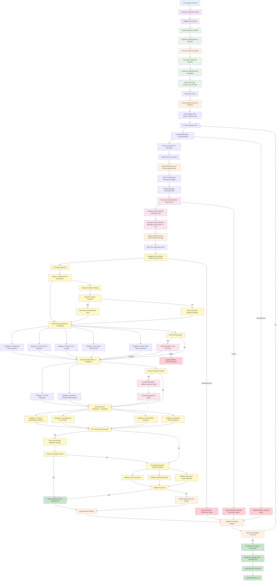

# CSV Upload Process Flow Diagram

## Process Flow Summary

### 1. **CSV Upload Phase**
- User uploads CSV file through frontend
- Frontend validates and sends to backend
- Backend saves file and creates database records
- Celery task starts processing

### 2. **Website Scraping Phase**
- Parse CSV to extract website URLs
- For each URL: scrape website content
- Extract contact form information and about us content
- Update database with scraping results

### 3. **AI Message Generation Phase (Enhanced)**
- **Business Content Analysis:** Use Gemini to analyze actual business content
- **Industry Detection:** Determine real industry from About Us content (not just field values)
- **Business Type Analysis:** Identify actual business type from scraped content
- **Industry-Specific Generation:** Generate messages relevant to actual business focus
- **Enhanced Prompts:** Use detailed prompts with more content (800 chars vs 500)
- Update database with generated messages

### 4. **Form Submission Phase (Enhanced with Multiple Strategies)**

#### **Primary Strategy: Traditional Form Submission (Enhanced)**
- **Form Detection (5 Strategies):**
  1. AI-detected form elements
  2. Common form selectors (expanded patterns)
  3. Find any form on page
  4. Trace input field parents to find forms
  5. Create virtual forms from input fields

- **Field Filling (2 Strategies):**
  1. AI field mappings
  2. Enhanced common field selectors (expanded patterns for name, email, message, phone, company)

- **Form Submission (4 Strategies):**
  1. Common submit button selectors (expanded)
  2. Find buttons by text content (expanded keywords)
  3. Find clickable elements that might submit
  4. JavaScript form submission

- **Success Verification:**
  - Check for success indicators in response
  - Verify URL changes
  - Analyze response content for errors

#### **Fallback Strategies:**
- AJAX submission
- Modal submission
- Alternative contact methods (email)

### 5. **Browser Selection Logic**
- Dynamic content detected → Firefox with Marionette fixes
- Standard content → Chrome with optimized options
- Automatic fallback between browsers

### 6. **Advanced Features**
- **CAPTCHA Handling:** Automatic detection and solving
- **Smart Field Handling:** AI analysis of unknown required fields
- **Error Recovery:** Multiple fallback strategies
- **Progress Tracking:** Real-time status updates

### 7. **Result Processing**
- Update website records with submission results
- Track success/failure rates
- Complete file upload processing
- Display results in frontend UI
